# Logseq GTD Template System - Workflow Diagrams

Visual representations of the GTD workflow implemented in the Logseq GTD Template System.

## 📊 Complete GTD Workflow

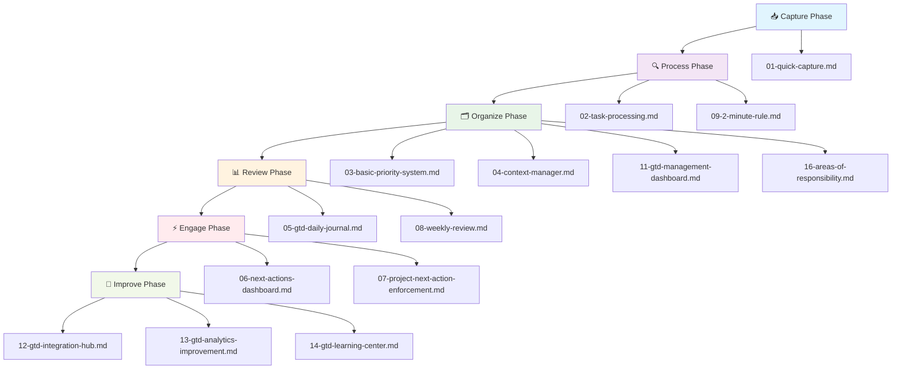

## 🔄 Daily Workflow

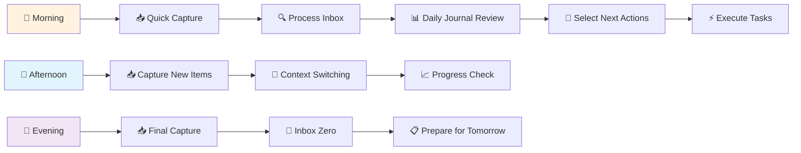

## 🗓️ Weekly Review Process

```mermaid
graph TB
    A[📅 Weekly Review] --> B[Step 1: Collect]
    B --> B1[Gather all loose items]
    B --> B2[Process inbox to zero]
    B --> B3[Review notes]
    
    A --> C[Step 2: Process]
    C --> C1[Review projects list]
    C --> C2[Review next actions]
    C --> C3[Review waiting-for]
    C --> C4[Review someday/maybe]
    
    A --> D[Step 3: Organize]
    D --> D1[Update project plans]
    D --> D2[Review contexts]
    D --> D3[Review calendar]
    
    A --> E[Step 4: Review]
    E --> E1[Review goals]
    E --> E2[Review areas of responsibility]
    E --> E3[Creative thinking]
    
    A --> F[Step 5: Engage]
    F --> F1[Plan coming week]
    F --> F2[Set priorities]
    F --> F3[Schedule key actions]
    
    style A fill:#e8f5e8
    style B fill:#e1f5fe
    style C fill:#f3e5f5
    style D fill:#fff3e0
    style E fill:#ffebee
    style F fill:#f1f8e9
```

## 📱 Mobile Capture Workflow

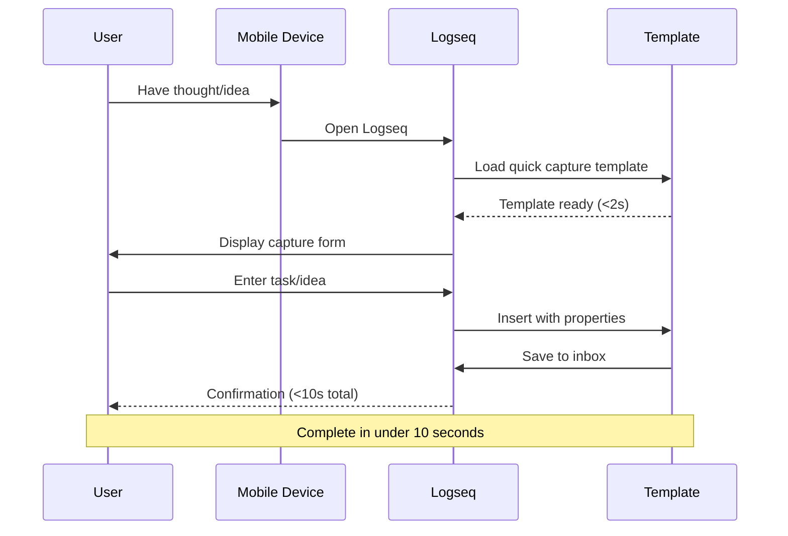

## 🏗️ Project Management Workflow

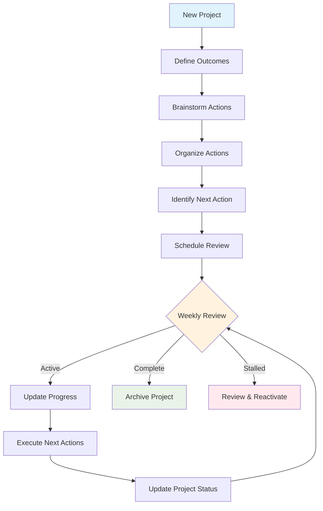

## 🔧 Context Switching Workflow

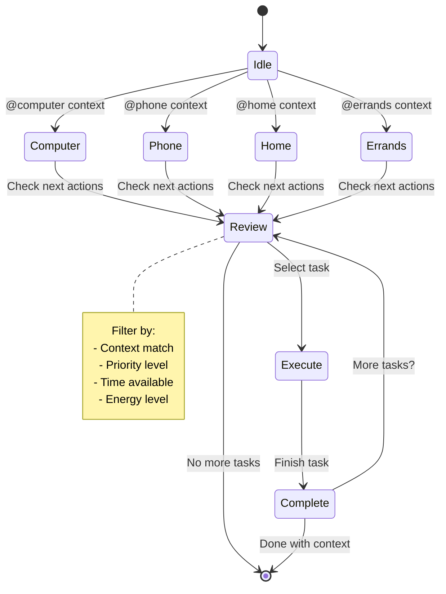

## ⚡ 2-Minute Rule Decision Tree

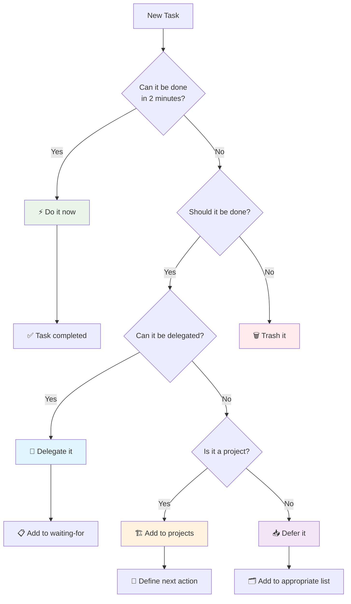

## 📈 Progress Tracking System

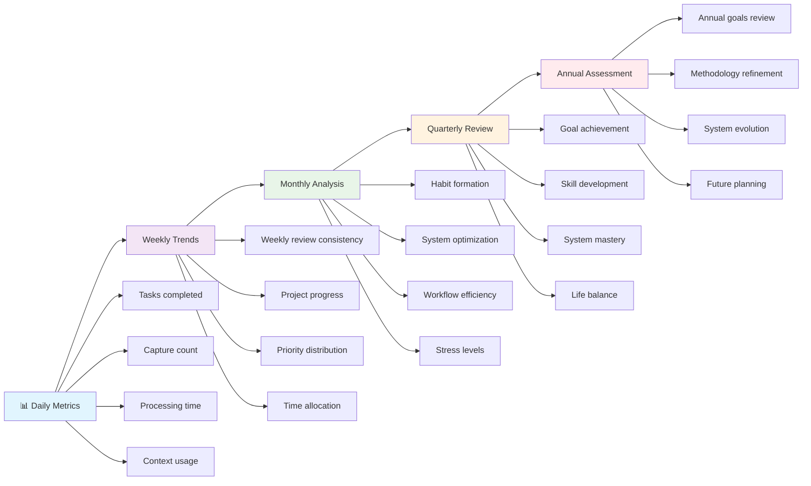

## 🔗 Integration Ecosystem

```mermaid
graph TB
    A[Logseq GTD System] --> B[📧 Email Integration]
    A --> C[📅 Calendar Sync]
    A --> D[💬 Messaging Apps]
    A --> E[📁 Cloud Storage]
    A --> F[🛠️ Productivity Tools]
    
    B --> B1[Process email to tasks]
    B --> B2[Track email responses]
    B --> B3[Archive reference emails]
    
    C --> C1[Sync appointments]
    C --> C2[Schedule review times]
    C --> C3[Block focus time]
    
    D --> D1[Capture messages]
    D --> D2[Track conversations]
    D --> D3[Reference discussions]
    
    E --> E1[Attach documents]
    E --> E2[Reference files]
    E --> E3[Backup system]
    
    F --> F1[Project management]
    F --> F2[Time tracking]
    F --> F3[Team collaboration]
    
    style A fill:#f1f8e9
    style B fill:#e1f5fe
    style C fill:#f3e5f5
    style D fill:#e8f5e8
    style E fill:#fff3e0
    style F fill:#ffebee
```

## 🎯 Template Selection Guide

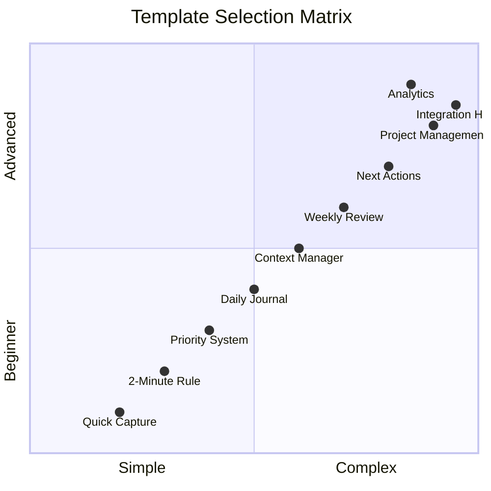

## 📋 Implementation Timeline

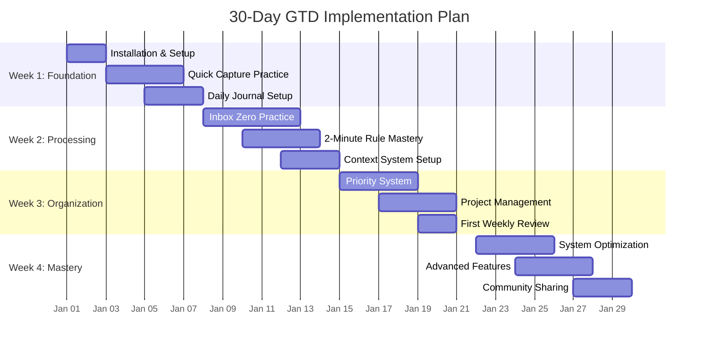

## 🎨 Visual Legend

### Color Scheme
- **📥 Capture Phase**: Light Blue (`#e1f5fe`)
- **🔍 Process Phase**: Light Purple (`#f3e5f5`)
- **🗂️ Organize Phase**: Light Green (`#e8f5e8`)
- **📊 Review Phase**: Light Orange (`#fff3e0`)
- **⚡ Engage Phase**: Light Red (`#ffebee`)
- **🚀 Improve Phase**: Light Lime (`#f1f8e9`)

### Icons
- 📥 **Capture**: Inbox/collection
- 🔍 **Process**: Clarification/analysis
- 🗂️ **Organize**: Filing/categorization
- 📊 **Review**: Assessment/evaluation
- ⚡ **Engage**: Action/execution
- 🚀 **Improve**: Enhancement/optimization
- 📱 **Mobile**: Mobile device
- 🏗️ **Project**: Construction/development
- 🔄 **Cycle**: Repetition/iteration
- 📈 **Analytics**: Data/measurement
- 🔗 **Integration**: Connection/linking

### Diagram Types
1. **Flow Charts**: Sequential processes
2. **Sequence Diagrams**: Time-based interactions
3. **State Diagrams**: State transitions
4. **Gantt Charts**: Timeline planning
5. **Quadrant Charts**: Classification matrices
6. **Graphs**: Relationship networks

## 📖 Usage Instructions

### For Documentation
These diagrams can be used in:
1. **README.md** - System overview
2. **USAGE.md** - Workflow explanations
3. **INSTALLATION.md** - Implementation guides
4. **PRESENTATIONS.md** - Community presentations

### For Customization
To customize these diagrams:
1. Copy the Mermaid.js code
2. Modify using [Mermaid Live Editor](https://mermaid.live/)
3. Update colors and labels as needed
4. Integrate into your documentation

### For Printing
1. Use dark mode for better print contrast
2. Adjust sizes for different media
3. Include legends for color coding
4. Add descriptive captions

---

**Diagram Version**: 1.0  
**Last Updated**: January 27, 2026  
**Tools Used**: Mermaid.js  
**Compatibility**: GitHub Markdown, Logseq, most documentation platforms

> *"A picture is worth a thousand words, but a good diagram is worth a thousand pictures when it comes to understanding complex workflows."*